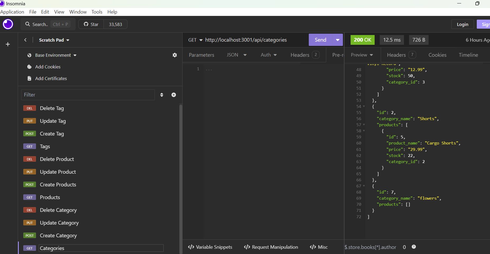

# 13 Object-Relational Mapping (ORM): E-Commerce Back End

## Description
E-commerce plays a pivotal role in the electronics industry, empowering both businesses and consumers to conveniently participate in online buying and selling of electronic products. Given the prevalence of these platforms, it is crucial to grasp the fundamental architecture of e-commerce sites.

Our challenge is to build a back end for an e-commerce site using Express.js and configure it to use Sequelize to interact with a PostgreSQL database.

## User Story
AS A manager at an internet retail company
I WANT a back end for my e-commerce website that uses the latest technologies
SO THAT my company can compete with other e-commerce companies

## Acceptance Criteria
GIVEN a functional Express.js API
WHEN I add my database name, PostgreSQL username, and PostgreSQL password to an environment variable file
THEN I am able to connect to a database using Sequelize
WHEN I enter schema and seed commands
THEN a development database is created and is seeded with test data
WHEN I enter the command to invoke the application
THEN my server is started and the Sequelize models are synced to the PostgreSQL database
WHEN I open API GET routes in Insomnia for categories, products, or tags
THEN the data for each of these routes is displayed in a formatted JSON
WHEN I test API POST, PUT, and DELETE routes in Insomnia
THEN I am able to successfully create, update, and delete data in my database

## Installatation
1. Clone the repository to your local machine.
2. Open the terminal and navigate to the root directory of the project.
3. Run the command "npm install" to install the necessary dependencies.
4. Create a .env file in the root directory of the project and add the following environment variables
- DB_NAME
- DB_USER
- DB_PW
5. Run the command "npm run seed" to seed the database with test data.
6. Run the command "npm start" to start the server.
7. Open Insomnia and test the API routes.
8. The four Insonmnia methods will use in the challenge is GET, POST, PUT and DELETE.
-GET routes to return all categories, all products, and all tags being tested in Insomnia Core.
-The POST, PUT, and DELETE routes for categories, products and tags being tested in Insomnia Core.

## Screenshot

## Walkthrough Video
https://drive.google.com/file/d/1a4c_dL6w7E8wwG38xFVHZYjVw-15CMXN/view?usp=sharing

## Credits
Class Lectures 
Youtube - Object-Relational Mapping Tutorials
Classmates - Thinh Nguyen and Faiza Haque

## Questions
If you have any questions or need further clarification, please don't hesitate to reach out to me at
marissa.melo91@yahoo.com or https://github.com/marissamelo91

